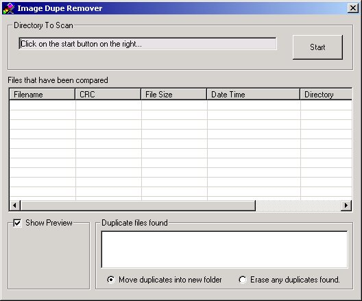



## Image Dupe Remover

### Description

Resource extractors are great but they pull a lot of the same images. So I needed a tool to search through the icons and remove the dupes and here is what I ended up with. (This code can just as easily compare any type of small files with little modification.)
 
### More Info
 

             |
---                |---
**Submitted On**   |2003-05-02 21:06:58
**By**             |[L\. M\. Trivette ](https://github.com/Planet-Source-Code/PSCIndex/blob/master/ByAuthor/l-m-trivette.md)
**Level**          |Advanced
**User Rating**    |4.5 (18 globes from 4 users)
**Compatibility**  |VB 4\.0 \(32\-bit\), VB 5\.0, VB 6\.0
**Category**       |[Complete Applications](https://github.com/Planet-Source-Code/PSCIndex/blob/master/ByCategory/complete-applications__1-27.md)
**World**          |[Visual Basic](https://github.com/Planet-Source-Code/PSCIndex/blob/master/ByWorld/visual-basic.md)
**Archive File**   |[Image\_Dupe158244522003\.zip](https://github.com/Planet-Source-Code/l-m-trivette-image-dupe-remover__1-45199/archive/master.zip)

